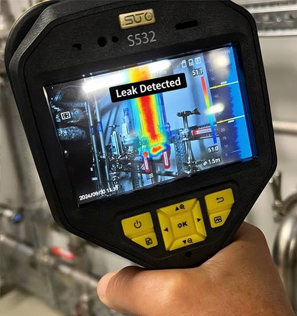
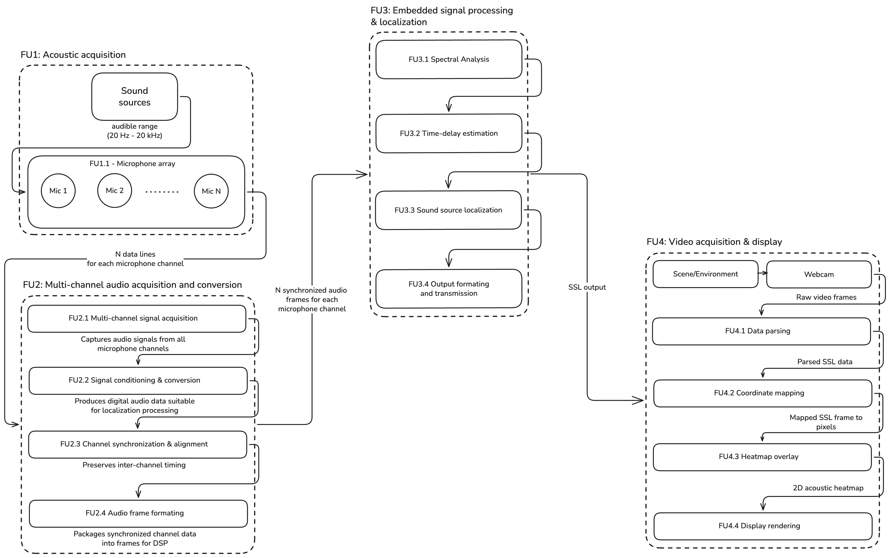
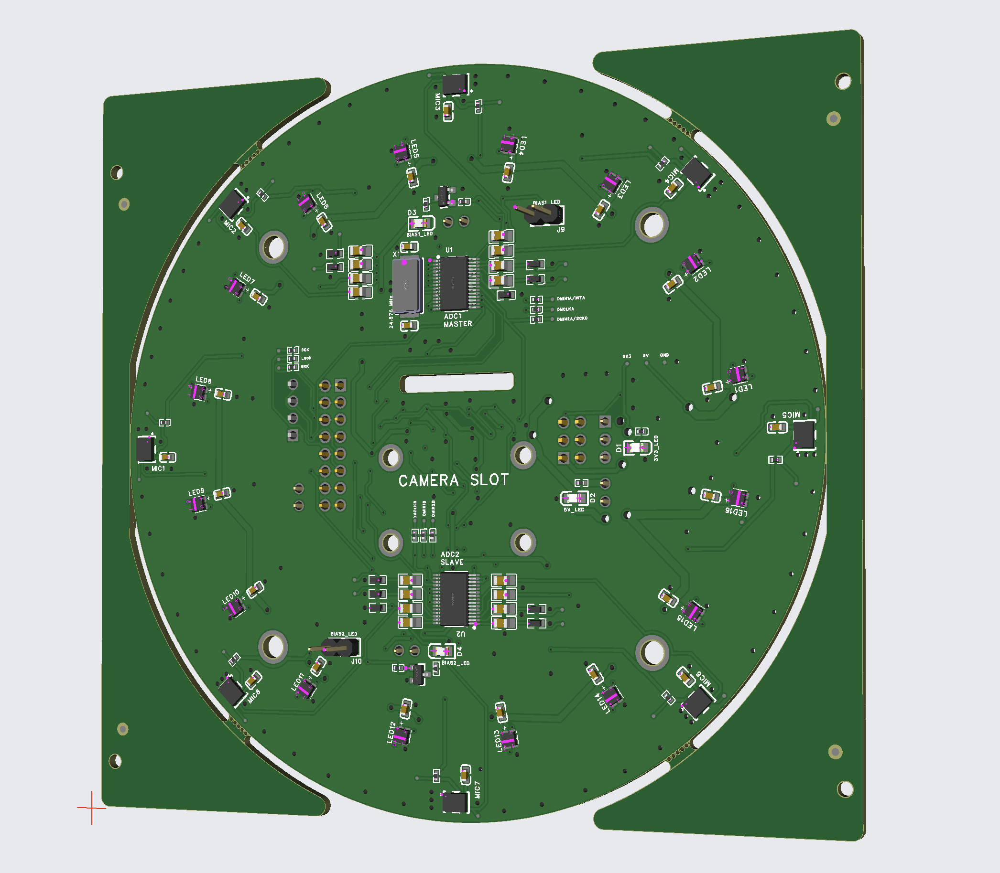
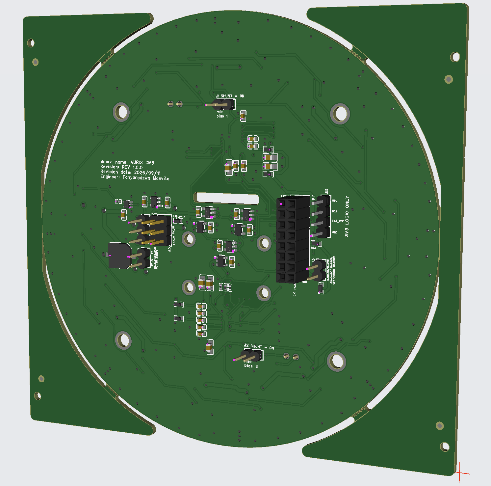
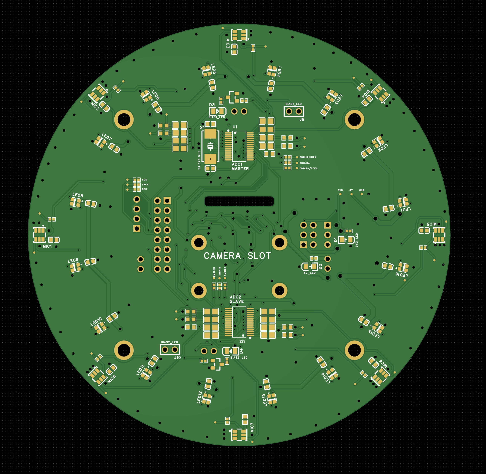
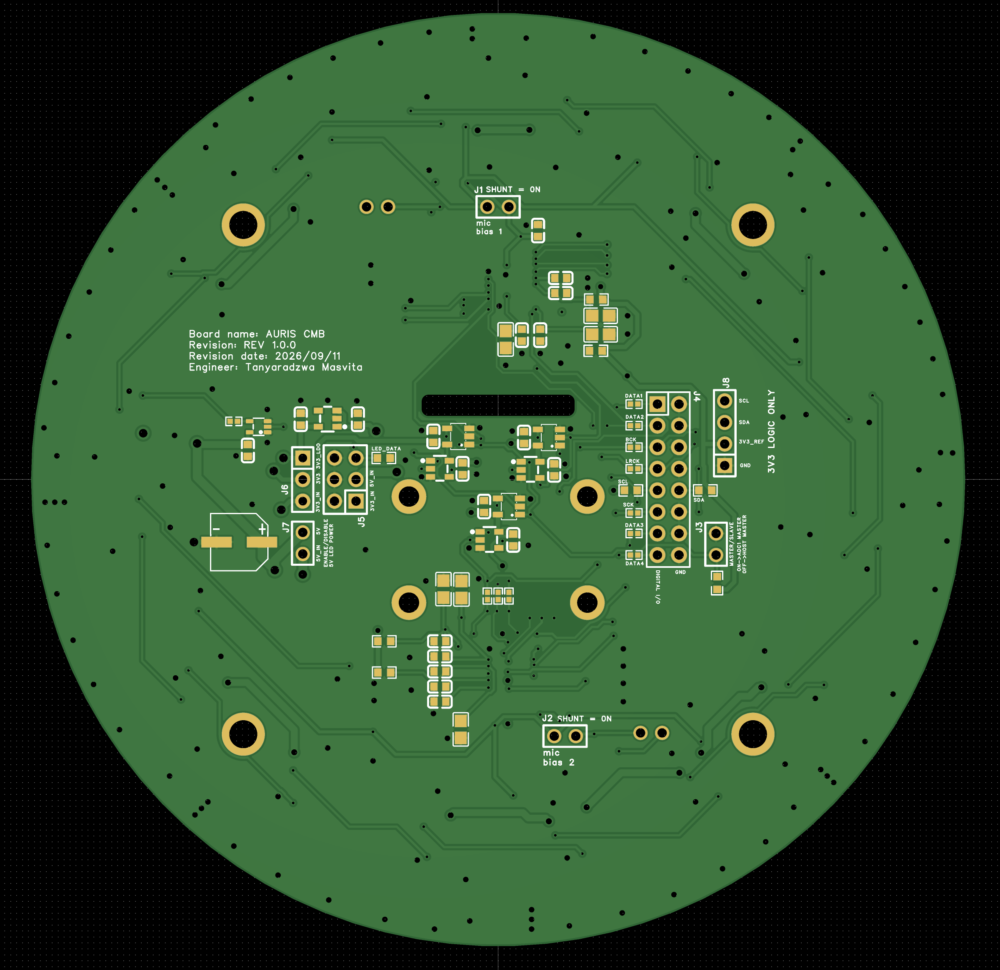
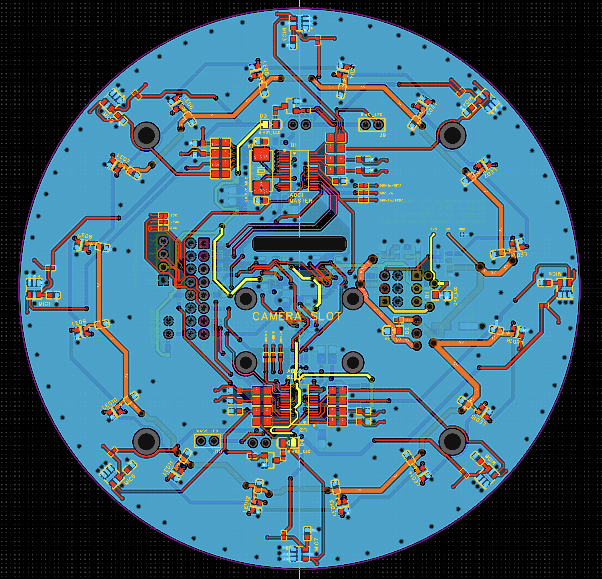
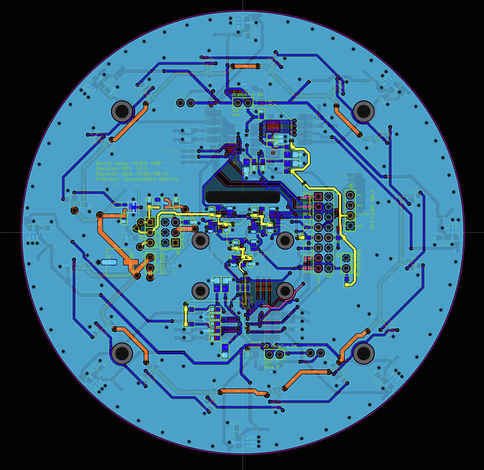

# Auris

**Real-time 3D acoustic direction estimation on embedded hardware**

Auris is an embedded acoustic-imaging system built around a synchronized eight-microphone array and a BeagleBone AI-64. It estimates the azimuth and elevation of a sound source, maps that estimate into camera coordinates, and presents the result as a heatmap over live video.

> [!NOTE]
> Auris is under active development. The repository currently contains the embedded C signal-processing foundation and hardware bring-up utilities; the complete 3D localization and video-overlay pipeline is being integrated incrementally.

<p align="center">
  
</p>

<p align="center"><em>Reference application: the intended operator experience is a live visual indication of where sound is originating.</em></p>

## Why it exists

Many industrial faults become audible before they become visible or catastrophic. Compressed-air leaks, bearing damage, electrical discharge, loose components, and abnormal machine interactions all create acoustic signatures, but a conventional sound-level measurement cannot tell an operator where the sound originated.

Auris treats localization as an end-to-end engineering problem. The system must preserve sub-sample timing relationships across eight analogue channels, operate within the spatial limits of the array geometry, reject noise and reverberation, execute the localization workload on embedded hardware, and convert a direction in the array frame into an intuitive visual result.

The design is intended for indoor condition monitoring and diagnostic use, where a portable instrument can be aimed at equipment and return the dominant source direction in real time.

## What the system does

1. Captures eight microphone channels against a shared sampling clock.
2. Converts and packages the channels as synchronized PCM audio frames.
3. Removes per-channel DC bias, applies an analysis window, and transforms each channel into the frequency domain.
4. Estimates pairwise time differences of arrival with GCC-PHAT.
5. Evaluates candidate azimuth and elevation directions using SRP-PHAT.
6. Formats the localization result for the visualization frontend.
7. Maps the estimate into camera coordinates and overlays an acoustic heatmap on live video.

This separation keeps acquisition, localization, and presentation independently testable while preserving the timing metadata required across the complete pipeline.

## System architecture

The system is divided into four functional units: acoustic acquisition, synchronized multichannel conversion, embedded localization, and video acquisition/display. The interfaces between them carry either explicitly synchronized audio frames or a compact sound-source-localization result.



- **FU1 - Acoustic acquisition:** the physical microphone aperture samples the incident sound field.
- **FU2 - Multichannel acquisition and conversion:** the analogue channels are sampled from a common clock domain, aligned, and framed without losing inter-channel timing.
- **FU3 - Embedded signal processing and localization:** spectral analysis, delay estimation, spatial search, and output formatting run on the embedded platform.
- **FU4 - Video acquisition and display:** the frontend combines the localization output with calibrated camera frames and renders the heatmap.

## Engineering requirements

| Area | Requirement | Target specification | Verification approach |
|---|---|---|---|
| 3D localization | Estimate the azimuth and elevation of one source within the camera field of view. | No more than **+/-15 degrees** error in azimuth and elevation, for a source up to 10 m away and within at least a +/-30 degree azimuth by +/-20 degree elevation field of view. | Place a source at known angular positions and compare the reported direction with the surveyed direction. |
| Operating band | Localize impulsive or continuous sources over the useful direction-of-arrival band. | Maintain the angular-accuracy target from **500 Hz to 3 kHz**. | Sweep tones and broadband sources across the specified band at known positions. |
| Noise robustness | Estimate source direction in broadband background noise. | Maintain the angular-accuracy target at **0 dB SNR**, measured as equal band-limited source and noise power at the array. | Repeat a fixed-position test in quiet conditions and with calibrated pink noise. |
| Real-time output | Keep localization and visualization responsive to operator movement. | At least **5 heatmap updates/s** and no more than **500 ms** end-to-end latency from audio capture to visible update. | Measure update rate over 30 s and timestamp a common acoustic/visual event through the pipeline. |
| Reverberation | Operate in realistic indoor acoustic environments. | Maintain the angular-accuracy target for rooms with **RT60 between 0.4 s and 1.1 s** over the 500 Hz-3 kHz localization band. | Characterize the room RT60, then test predefined source positions against ground truth. |

## Hardware design

The custom **Auris CMB** is a circular eight-microphone acquisition board. Eight analogue MEMS microphones are distributed around the perimeter to provide a repeatable aperture around a central camera opening. The geometry gives the localization algorithm multiple non-collinear baselines while keeping the acoustic and optical coordinate frames mechanically coupled.

<table>
  <tr>
    <td align="center"><br><strong>Front assembly</strong></td>
    <td align="center"><br><strong>Back assembly</strong></td>
  </tr>
</table>

The acquisition architecture uses two four-channel audio ADCs in a master/slave arrangement. A 24.576 MHz oscillator and shared digital-audio timing distribute the bit clock and left/right frame clock across both converters so that all eight channels retain a common sample-time reference. Separate data outputs carry the converted channels to the embedded platform. Configurable microphone-bias and board-power headers support bring-up and subsystem isolation.

Key hardware concerns are treated as localization constraints rather than only PCB constraints:

- **Synchronization:** channel skew directly becomes time-delay error, so clock-domain integrity is part of the measurement chain.
- **Geometry:** microphone coordinates, aperture, and pair baselines determine angular observability and the physically valid delay bounds.
- **Spatial aliasing:** microphone spacing limits the unambiguous operating bandwidth and must be evaluated with the selected localization band.
- **Signal integrity:** clock and serial-audio routing are kept controlled and separated from sensitive microphone inputs.
- **Power integrity:** local decoupling and explicit analogue/digital supply routing reduce correlated interference across channels.
- **Mechanical registration:** the central camera opening provides a stable relationship between array and image coordinates.

<table>
  <tr>
    <td align="center"><br><strong>Front fabrication view</strong></td>
    <td align="center"><br><strong>Back fabrication view</strong></td>
  </tr>
  <tr>
    <td align="center"><br><strong>Front-side routing</strong></td>
    <td align="center"><br><strong>Back-side routing</strong></td>
  </tr>
</table>

## Signal processing

The localization pipeline operates on overlapping, channel-synchronous analysis frames:

```text
PCM capture -> continuity check -> 512-sample frame / 256-sample hop
            -> per-channel mean removal -> Hann window
            -> real FFT -> GCC-PHAT for each microphone pair
            -> physically constrained lag estimates
            -> SRP-PHAT azimuth/elevation search
            -> peak direction + confidence -> frontend message
```

For microphones `i` and `j`, the phase-transform cross-spectrum is

```math
\Psi_{ij}(f) = \frac{X_i(f)X_j^*(f)}{|X_i(f)X_j^*(f)| + \varepsilon},
```

and its inverse transform produces the generalized cross-correlation

```math
R_{ij}^{\mathrm{PHAT}}(\tau) = \mathcal{F}^{-1}\{\Psi_{ij}(f)\}.
```

PHAT normalization suppresses magnitude information and emphasizes phase consistency, which makes the delay estimator less dependent on the source spectrum. The lag search is restricted by each microphone pair's separation:

```math
|\tau_{ij}| \leq \frac{\|\mathbf{p}_i-\mathbf{p}_j\|}{c},
```

where `p_i` and `p_j` are microphone positions and `c` is the configured speed of sound.

SRP-PHAT converts the pairwise correlations into a spatial objective. For a candidate unit direction `q`, the expected far-field delay for each pair is sampled and accumulated:

```math
P(\mathbf{q}) = \sum_{i \lt j} R_{ij}^{\mathrm{PHAT}}\!\left(\tau_{ij}(\mathbf{q})\right),
\qquad
\tau_{ij}(\mathbf{q}) = \frac{(\mathbf{p}_j-\mathbf{p}_i)\cdot\mathbf{q}}{c}.
```

The maximizing direction becomes the azimuth/elevation estimate. Separating array geometry from the FFT and correlation implementation allows the same processing core to support the four-channel bring-up array and the custom eight-channel board.

## Embedded implementation

The embedded software is written in **C17** and built with **CMake**. It is organized around explicit data contracts rather than a monolithic capture loop:

- `auris_audio_block_t` carries bounded, planar multichannel samples with sample rate, channel count, frame count, and an absolute first-frame index.
- `auris_audio_source_t` abstracts acquisition behind a `read` callback. ALSA provides live BeagleBone capture, while the replay backend supplies deterministic PCM input for tests and demonstrations.
- `auris_framer_t` validates stream continuity and assembles 512-sample analysis frames with a 256-sample hop.
- The preprocessing stage removes channel means and applies a symmetric Hann window without mutating retained overlap history.
- The spectrum layer owns reusable FFTW single-precision plans and buffers, avoiding plan construction in the processing loop.
- Array utilities validate microphone configurations, enumerate unique pairs, compute spacing/aperture, estimate spatial-alias limits, and derive physical TDOA bounds.

The current ALSA backend captures 16-bit interleaved samples at **16 kHz** in 128-frame blocks, maps selected device channels into a fixed eight-channel internal representation, and converts samples to normalized floating point. Absolute frame indices make discontinuities observable instead of silently corrupting the delay estimator.

The codebase enables strict compiler warnings and debug sanitizers by default. Tests cover status handling, geometry and pair generation, replay/capture contracts, frame overlap, discontinuity rejection, and preprocessing invariants.

```text
core/           hardware-independent geometry, framing, preprocessing and DSP
drivers/audio/  ALSA capture and deterministic replay backends
configs/        microphone-array geometry and channel maps
apps/           small bring-up, inspection and capture programs
tests/          contract and signal-path tests
```

## Build and reproduce

On Debian with CMake, Ninja, ALSA development headers, and single-precision FFTW installed:

```bash
cmake -S . -B build -G Ninja
cmake --build build
ctest --test-dir build --output-on-failure
```

Inspect the configured array with `./build/apps/auris_array_info` or run the deterministic signal-path demonstration with `./build/apps/analysis_demo`.
